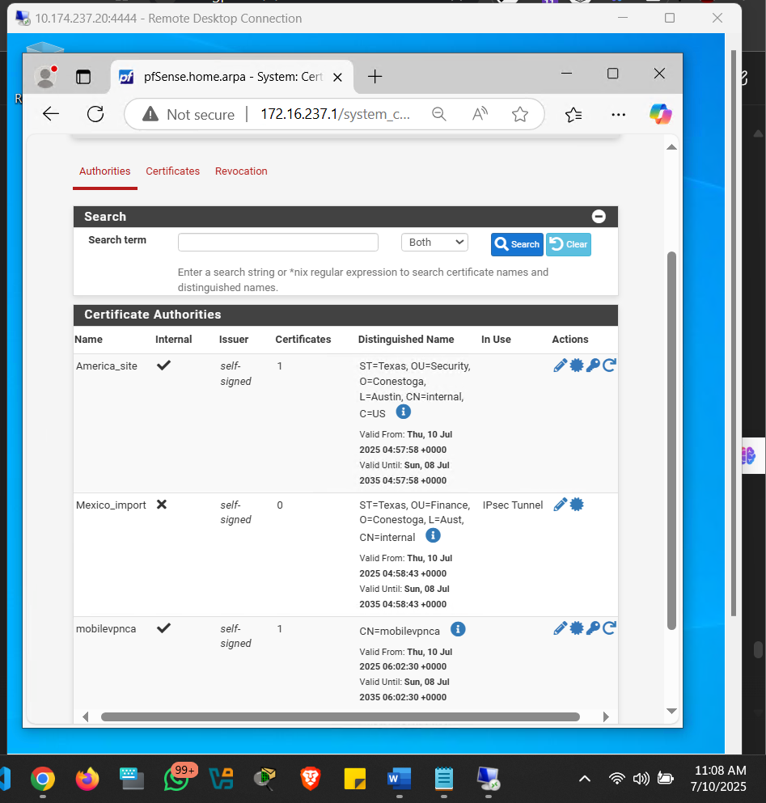
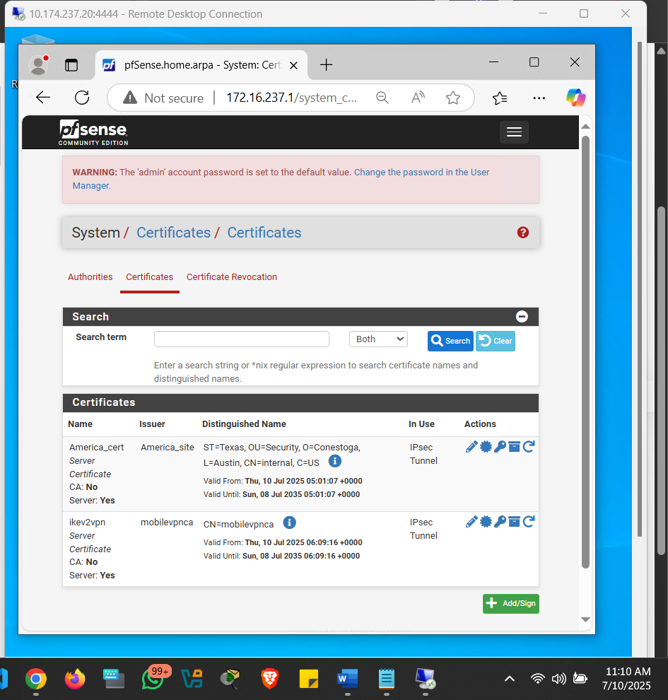
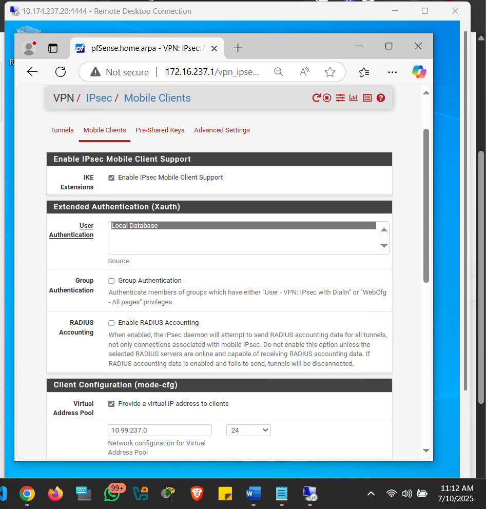
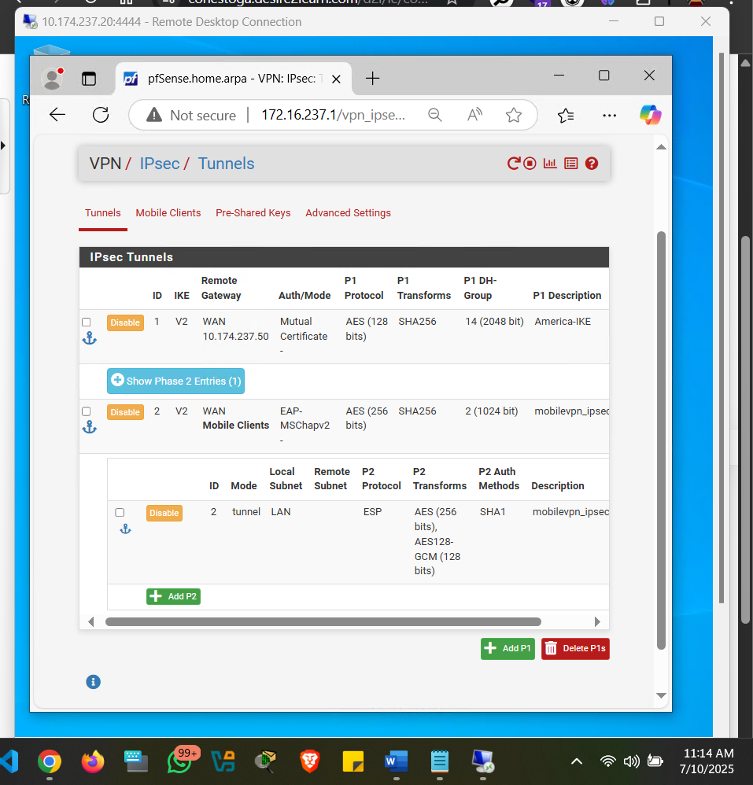
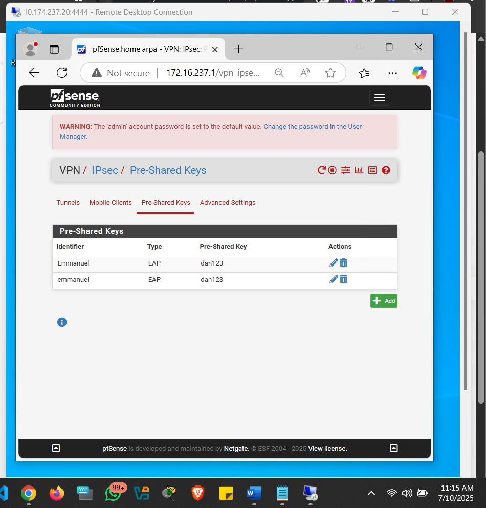
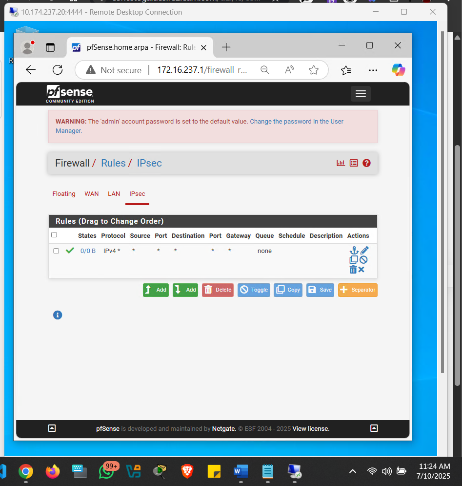
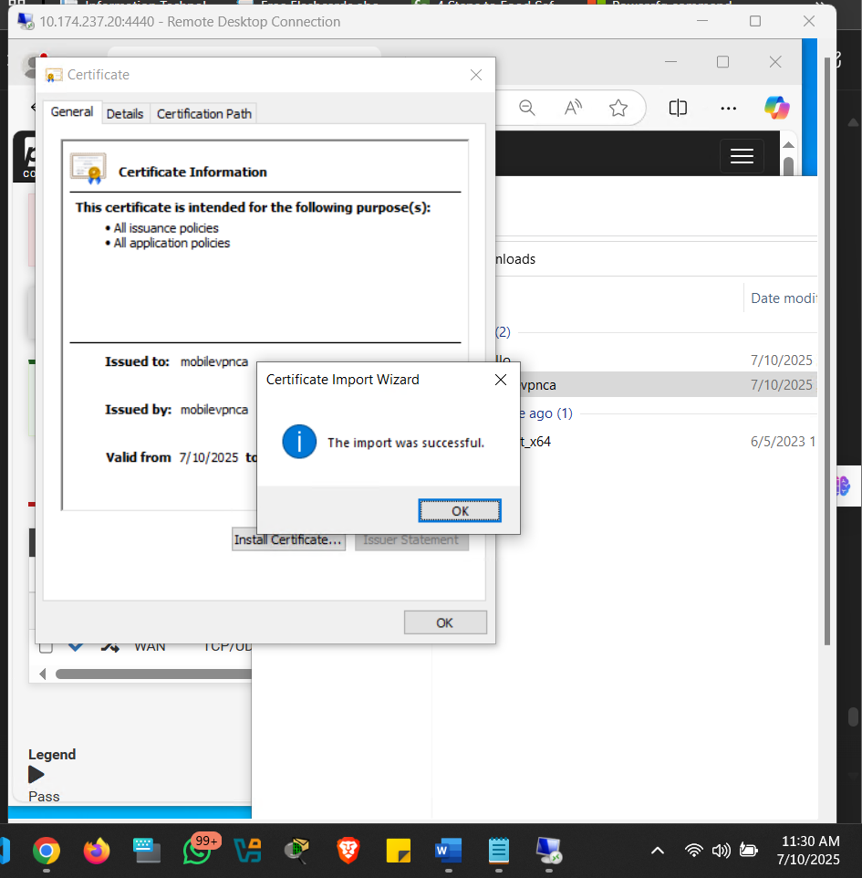
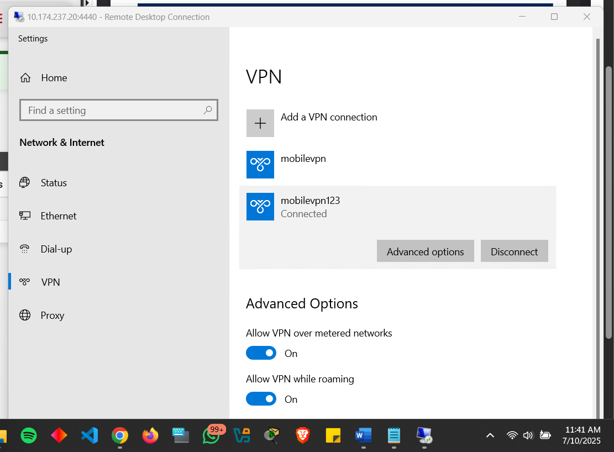
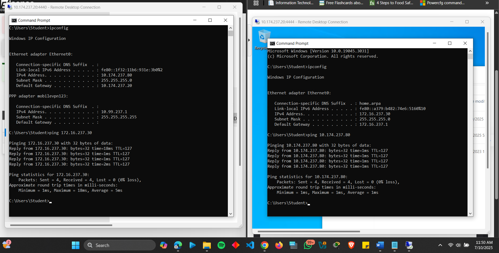

# Project: Host-to-Network IPSEC VPN (Roadwarrior)

## Overview
Configured a **remote access VPN** on pfSense using IKEv2 with certificate authentication, enabling secure external access to LAN resources. Implemented EAP-MSCHAPv2 user authentication and validated connectivity from a Windows 10 client.

---

## Implementation Steps & Screenshots

#### 1. Certificate Authority and Server Certificate Setup
- Created a CA named **`mobilevpnca`** on the pfSense firewall  
- Generated server certificate **`Ikev2vpn`** for VPN authentication  

  
*CA creation on pfSense*  

  
*Server certificate assigned for VPN authentication*

---

#### 2. IPSEC Mobile Client Configuration
- Enabled IPsec Mobile Client Support under `VPN > IPsec > Mobile Clients`  
- Configured user authentication using the local database  
- Created a virtual IP address pool: `10.99.237.0/24`  

  
*Enabled mobile client support and virtual IP pool*

---

#### 3. IPsec Phase 1 and Phase 2 Configuration
- **Phase 1 (IKEv2):** EAP-MSCHAPv2 authentication, AES-256 encryption, SHA256 hashing  
- **Phase 2 (IPsec):** Tunnel mode, ESP protocol, AES-256 encryption  

  
*Phase 1 settings with EAP-MSCHAPv2 and AES-256 and Phase 2 settings with ESP protocol and AES-256*

---

#### 4. User Account Setup
- Created user **`Emmanuel`** with EAP authentication  

  
*User account for VPN authentication*

---

#### 5. Firewall Rules
- Added an allow-all rule for IPsec traffic to permit VPN connections  

  
*Allow-all IPsec traffic rule*

---

#### 6. Windows 10 Client Setup
- Imported CA certificate on the Windows 10 client  
- Created VPN connection via PowerShell using IKEv2 + EAP authentication  
- Added a route for LAN subnet (`172.16.237.0/24`)  

  
*CA certificate successfully installed on Windows 10*  

  
*PowerShell commands for VPN connection and route*

---

#### 7. Connection Validation
- Successfully connected from the Windows 10 client  
- Verified connectivity by pinging LAN host `172.16.237.30`  

  
*Windows 10 VPN connection established*  

  
*Ping from remote client to LAN host confirms connectivity*

---

### **Observations and Challenges**
1. **Certificate Configuration:** Initially, VPN failed due to mismatched certificate details. Regenerating certificates with correct parameters resolved the issue.  
2. **Client Setup:** VPN connection failed initially as PowerShell commands were not run as administrator; resolved by using elevated privileges.  
3. **Security Benefits:** Encrypted communication ensures confidentiality and integrity; certificate-based authentication provides stronger security than pre-shared keys.  
4. **Limitations:** Certificate management requires careful setup; VPN performance may be affected by network latency and bandwidth; client devices must be secure to prevent unauthorized access.  

---

### **How to Reproduce**
1. **Requirements:**  
   - pfSense firewall with WAN/LAN interfaces  
   - Windows 10 VM for remote client testing  

2. **Steps:**  
   ```bash
   # On pfSense Web UI:
   1. System > Cert. Manager > Create CA ("mobilevpnca")
   2. Generate server certificate ("Ikev2vpn") with correct parameters
   3. VPN > IPsec > Mobile Clients > Enable support & configure virtual IP pool
   4. VPN > IPsec > Phase 1/2 settings with IKEv2 + EAP-MSCHAPv2
   5. Firewall > Rules > Add allow-all rule for IPsec
   # On Windows 10 Client:
   6. Import CA certificate
   7. Create VPN connection using PowerShell
   8. Add route for LAN subnet
   9. Test connectivity via ping